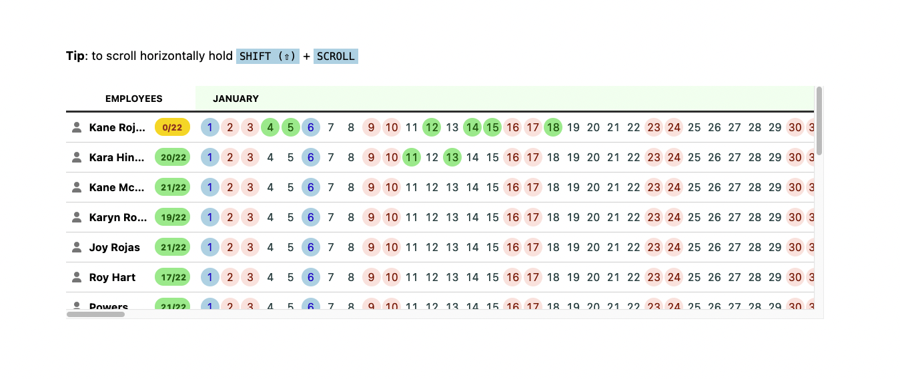
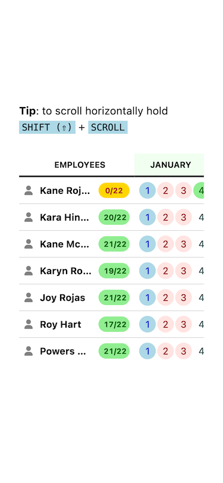
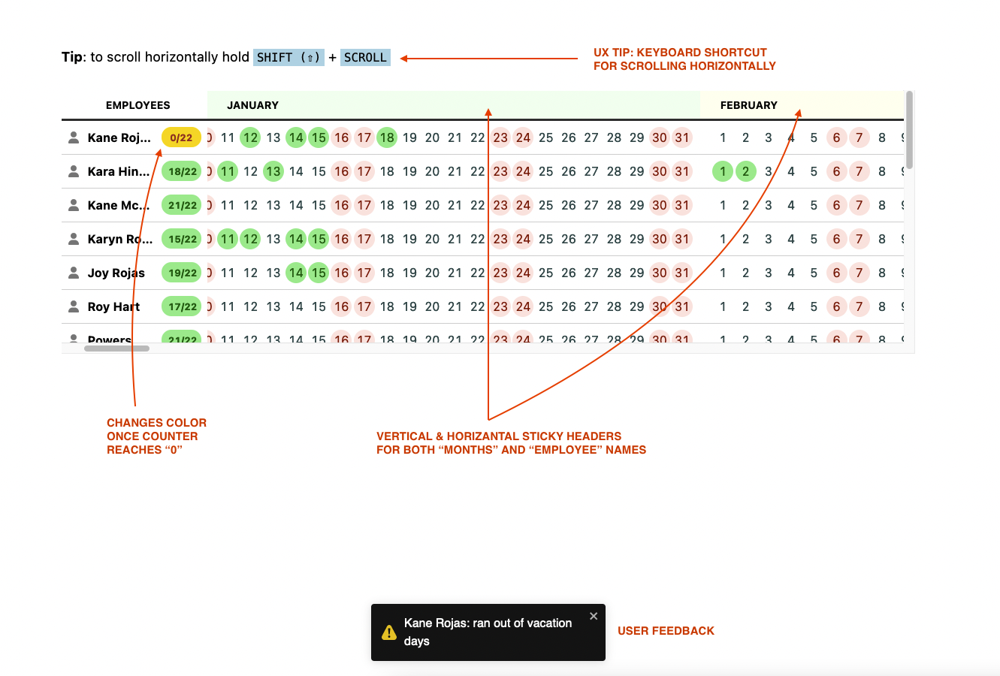
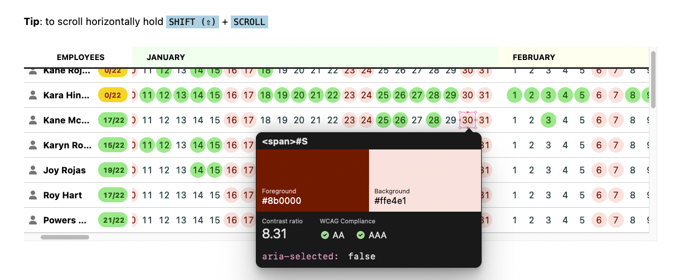

# Coding challange for Mayoral

Challange: create a calendar app for managing employee vacations. 1) higlight holidays in blue & weekends in red, 2) keep track of remaining vacations next to the employee's name, and 3) keep data stored in the `localStorage`

## Technologies used

- React
- Next.js
- Typescript
- Sass
- React toastify

## About my process

I've used Next.js so that I could mock the handed json files as api calls. These are called [API routes in Next.js](https://nextjs.org/docs/api-routes/introduction). Typescript was added so that I could practice my recentlty acquired skill in this topic. I also added [React toastify](https://fkhadra.github.io/react-toastify/introduction) for giving some feedback to the user once an employee runs out of vacations days.

## Responsive

## UX/UI

## WCAG Compliance

Web Content Accessibility Guidelines for colors. A nice combination of pastel colors for better constrast and readability.

